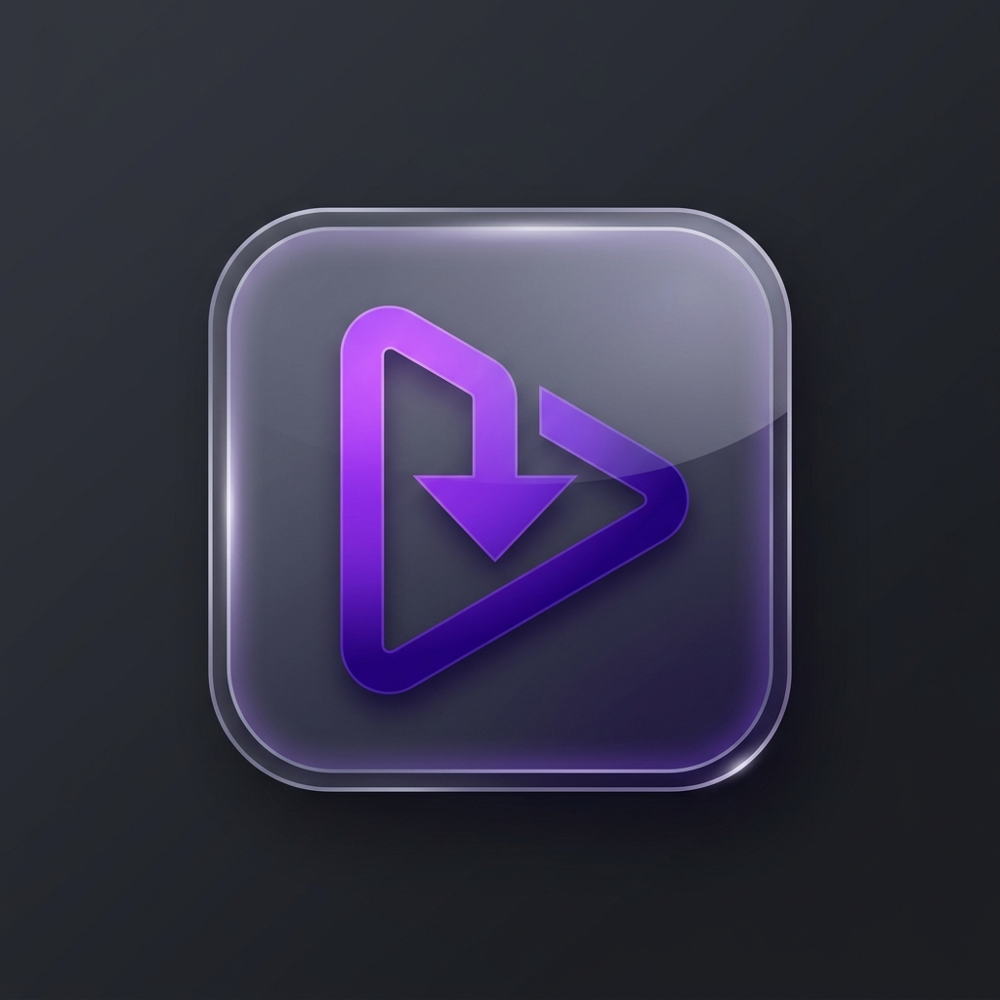
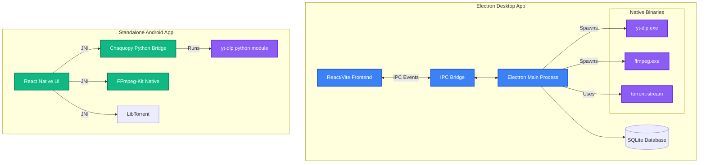

<div align="center">
  
  
  # Universal Media Downloader
  
  **A beautiful, lightning-fast, and powerful cross-platform media extraction tool.**
  
  [](#-download)
  [](#-download)
  [](#)
  [](#)
  [](#)

</div>

---

## 📥 Download (Latest Releases)

Get the latest versions directly from our automated deployment pipelines. No zips, no extracting, just one-click direct installs!

### 💻 Desktop (Windows)
> **[⬇️ Download Universal Media Downloader (.exe)](https://github.com/WhoisMonesh/YT-Downloader-Electro/releases/download/latest/Universal.Media.Downloader.0.2.0.exe)**

### 📱 Mobile (Android)
> **[⬇️ Download Universal Media Downloader (.apk)](https://github.com/WhoisMonesh/YT-Downloader-Electro/releases/download/mobile-latest/app-debug.apk)**

---

## ✨ What's New: UI & Aesthetic Upgrades

We've completely overhauled the UI to provide a state-of-the-art, premium experience:
- **Glassmorphism & Gradients**: Deep violet and indigo gradients overlayed with frosted glass panels.
- **Custom Fonts & Micro-animations**: Integrated the sleek **Outfit** font family alongside buttery smooth hover states and transition animations.
- **Custom Application Icons**: Full high-density native application icons built deeply into the Windows `.exe` and the Android `.apk`.
- **Dynamic Layout**: A fully responsive sidebar, sleek download queue visuals, and premium dark-mode aesthetics.

---

## 🚀 Features
- **Ultimate Media Support**: Download from thousands of websites (powered by highly optimized `yt-dlp`).
- **Torrent/Magnet Streaming**: Seamless peer-to-peer downloads with zero seeding via `torrent-stream`.
- **Conversion & Merging**: Embedded FFmpeg pipeline for complex video-audio merging and format conversion right on your machine.
- **Native Android Client**: A fully standalone Android counterpart utilizing React Native, delivering the same immense power to your phone.

---

## 🏗️ Architecture Diagram

Below is the high-level architecture diagram illustrating how the Electron Main Process communicates with native binaries, the React frontend, and the Android mobile app.



---

## 💻 Development (Desktop)

To run the Electron application locally:

```bash
# Install dependencies
npm install

# Start the dev server and Electron
npm run dev
```

To build the executable manually (Windows/Mac/Linux):
```bash
npm run build
npm run package
```

## 📱 Development (Mobile)

The standalone Android app lives in the `mobile/` directory.

```bash
cd mobile
npm install
npx react-native run-android
```
