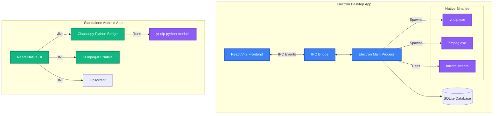

# Universal Media Downloader

Universal Media Downloader is a powerful, modern, and cross-platform desktop application built with Electron, React, Vite, and Tailwind CSS. It leverages the power of `yt-dlp` and `FFmpeg` to download video, audio, and torrent streams with unparalleled speed and reliability.

## 🚀 Features
- **Ultimate Media Support**: Download from thousands of websites (powered by yt-dlp).
- **Torrent/Magnet Streaming**: Seamless peer-to-peer downloads with zero seeding via `torrent-stream`.
- **Beautiful UI**: Modern glassmorphism UI with violet/indigo gradients.
- **Conversion & Merging**: Embedded FFmpeg pipeline for complex video-audio merging and format conversion.
- **Mobile Standalone App**: A fully native Android counterpart being built in React Native inside the `mobile/` directory.

## 🏗️ Architecture

Below is the high-level architecture diagram illustrating how the Electron Main Process communicates with native binaries, the React frontend, and the future Mobile app.



## 💻 Development (Desktop)

To run the Electron application locally:

```bash
# Install dependencies
npm install

# Start the dev server and Electron
npm run dev
```

To build the executable (Windows/Mac/Linux):
```bash
npm run build
```

## 📱 Development (Mobile)

The standalone Android app (Option 2) lives in the `mobile/` directory.

```bash
cd mobile
npm install
npx react-native run-android
```

## 🛠️ GitHub Actions (CI)
The project utilizes automated CI pipelines for seamless deployment:
- **`build.yml`**: Compiles the Electron application for Windows & Mac and packages the executable.
- **`android-native.yml`**: Compiles the React Native application using Gradle and generates an `app-debug.apk`.

> [!NOTE]
> All artifacts are securely hosted by GitHub Actions upon successful pushes to the main branch.
